<div align="center">


# ComfyUI RigShare

> One ComfyUI rig, a whole team: accounts, shared folders, live co-editing, chat and a GPU monitor

[](https://github.com/xiaodoudou/ComfyUI-RigShare/releases/latest) [](https://github.com/xiaodoudou/ComfyUI-RigShare/stargazers) [](LICENSE) [](docs/install.md) [](docs/install.md) [](docs/install.md) [](docs/security.md)

A custom node that turns a single ComfyUI server into a shared workspace. Everyone signs in, keeps their own workflows in a private folder, and edits the shared ones together in real time while seeing each other's cursors. Fork of
[daxcay/ComfyUI-Nexus](https://github.com/daxcay/ComfyUI-Nexus), rewritten for the current ComfyUI frontend.

</div>

---

## What it does

- asks everyone to sign in before ComfyUI loads, and creates the admin account on first run
- organises workflows like a shared drive: a private **My files** folder per account, **Shared** folders, and an **All** view for admins, in a Files tab of its own
- asks where to save, with the same folders, and opens workflows from them (Ctrl+Alt+O)
- makes every workflow outside a private folder live while it is open: people who open the same file edit it together, with nothing to share by hand
- lets folder owners restrict a shared folder to chosen people, each able to view or edit
- lets you switch tabs freely, because only the tab on screen syncs, and keeps open tabs pointed at a workflow when someone renames or moves it
- shows who is online and which workflow they are on, plus live cursors and selections
- lets you follow someone, jumping to their tab and view
- keeps the whole chat history, loading older messages as you scroll up, with an unread badge, a blinking icon and a sound; admins can clear it
- shows the queue: what is running and waiting, and who launched each run, with a button to stop or remove your own
- keeps per-workflow history: a snapshot on every save and every few minutes, named snapshots, one-click restore
- works in ComfyUI's App mode: everyone picks their own graph or App view, App inputs sync live, and you can see who is in which view
- gives each account permissions to edit, queue, use ComfyUI Manager or administer, enforced by the server and not just hidden in the UI
- keeps simultaneous edits apart: two people adding or connecting nodes at the same moment both keep their work
- issues personal API keys, so scripts and other apps can call ComfyUI with their owner's permissions
- shows CPU, RAM, and for each GPU the load, VRAM, temperature and power, in a panel tab or a floating widget
- sends execution progress and previews to everyone, not only whoever queued

What this fork adds over Nexus:

- **Built for the new frontend.** It lives in a sidebar tab and works with workflow tabs and subgraphs. It needs no legacy menu and no litegraph patching.
- **Real accounts.** A login page, hashed passwords, JWT sessions and API keys replace the shared `/login account password` chat command and the plaintext `admins.json`.
- **The server is in charge.** It checks permissions and identity on every message, so a browser cannot impersonate someone or edit without the right to.
- **Folders, not one canvas.** Everyone has their own space, shared work lives in shared folders, and nobody fights over a single canvas.

## Screenshots

<table>
  <tr>
    <td align="center">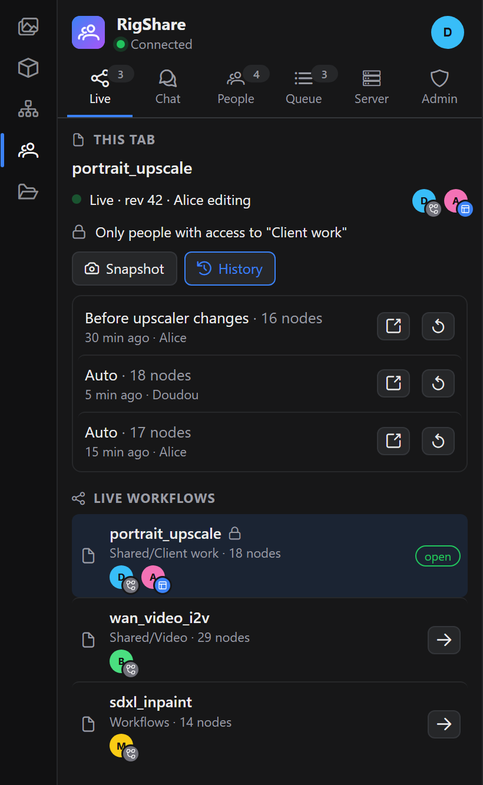<br><sub>Live workflows and history</sub></td>
    <td align="center">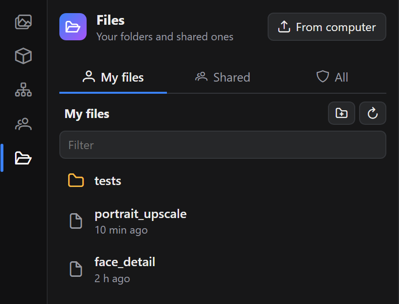<br><sub>Files: My files, Shared, All</sub></td>
    <td align="center">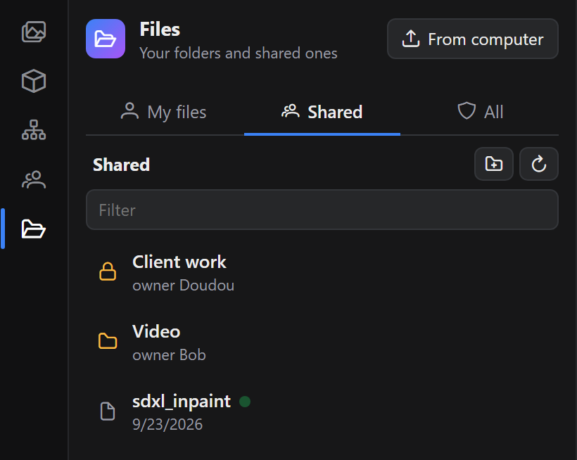<br><sub>Shared folders, live files marked</sub></td>
  </tr>
  <tr>
    <td align="center">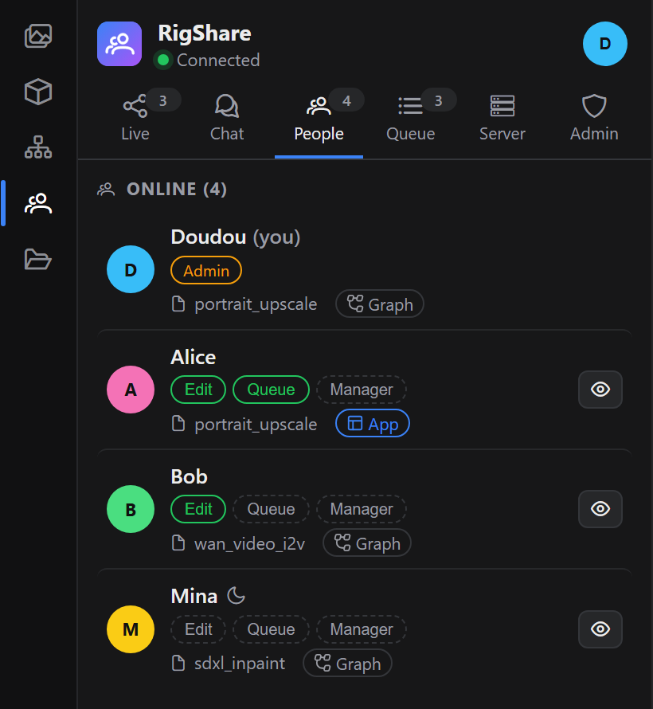<br><sub>Who is online, and on which workflow</sub></td>
    <td align="center">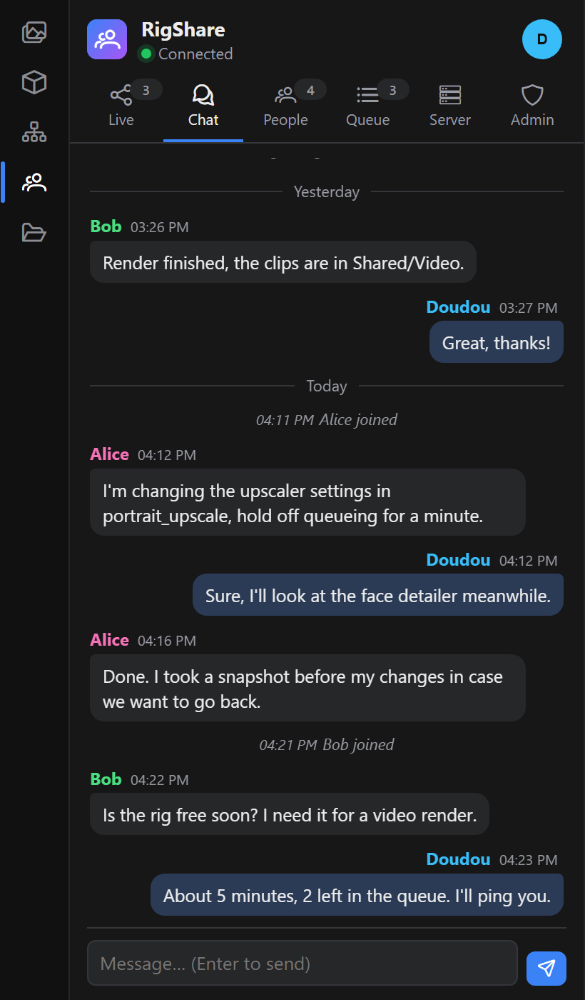<br><sub>Chat, with the whole history</sub></td>
    <td align="center">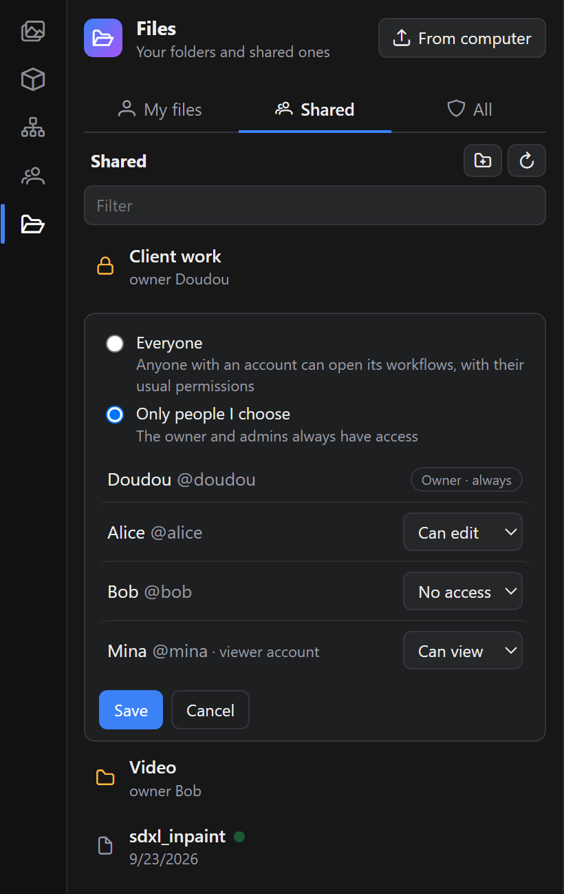<br><sub>Who can open a folder</sub></td>
  </tr>
  <tr>
    <td align="center">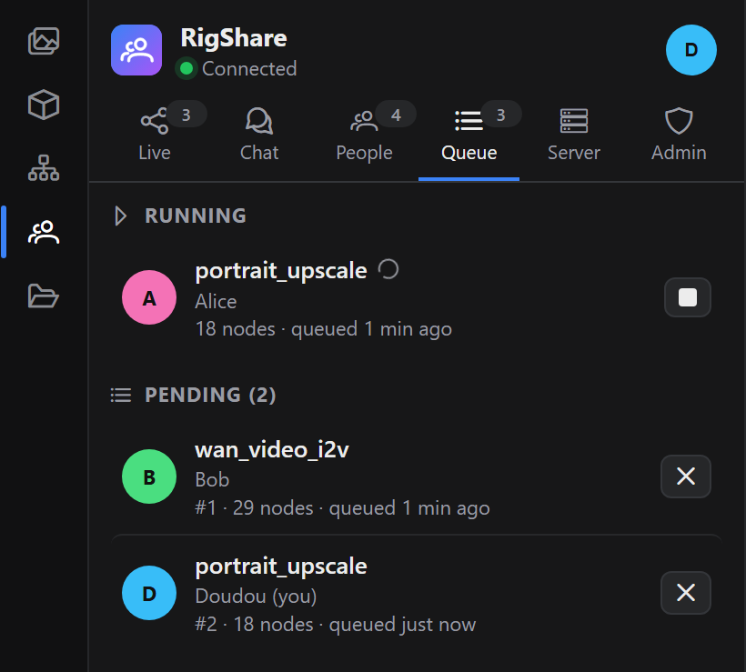<br><sub>Queue: who launched what</sub></td>
    <td align="center">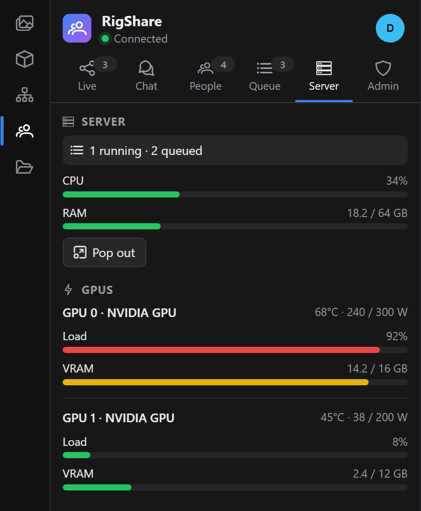<br><sub>Server monitor</sub></td>
    <td align="center">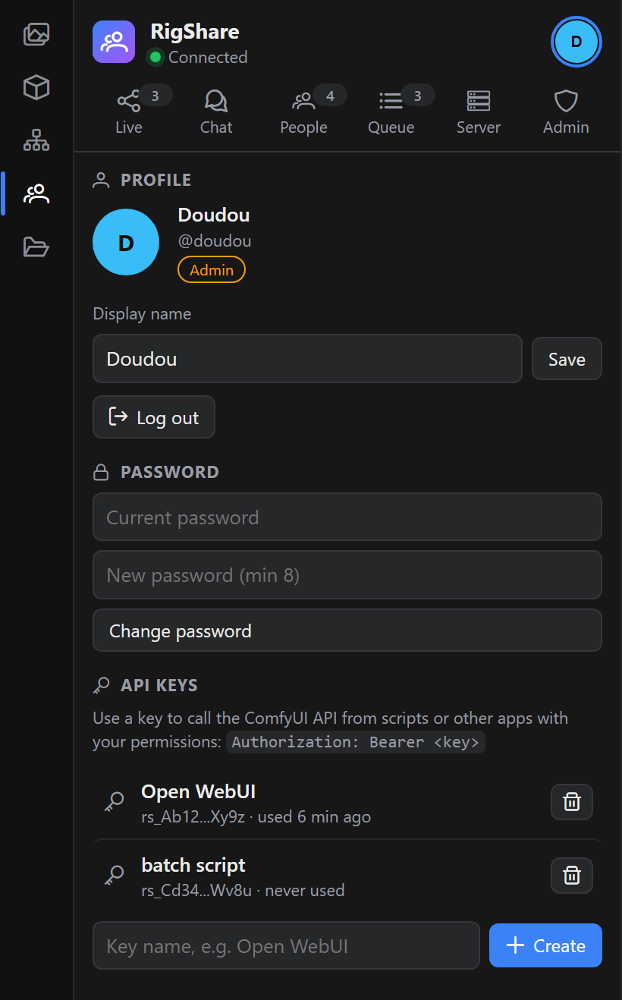<br><sub>Account and API keys</sub></td>
  </tr>
  <tr>
    <td align="center">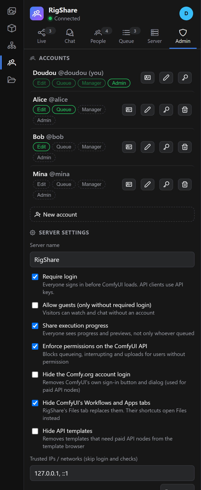<br><sub>Accounts and server settings</sub></td>
    <td></td>
    <td></td>
  </tr>
</table>

<p align="center">
  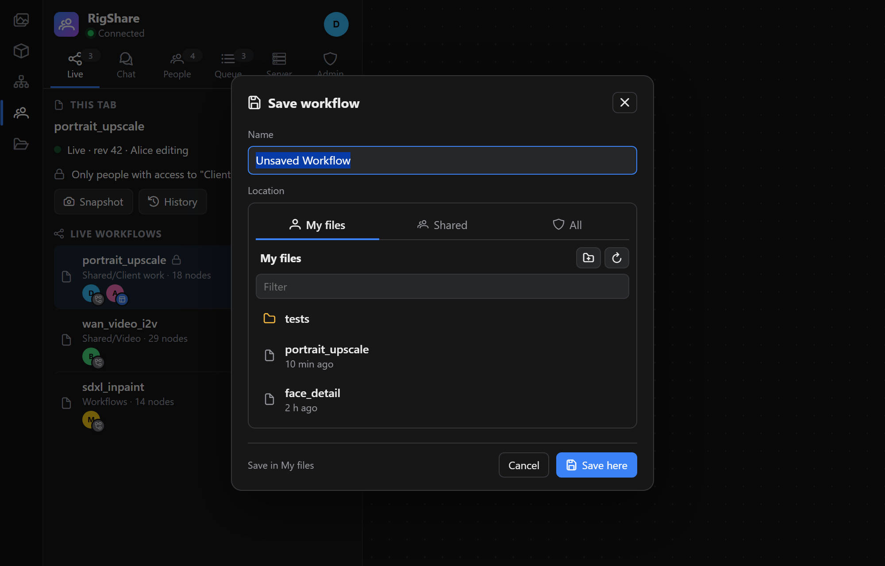<br><sub>Save asks where</sub>
</p>

<p align="center">
  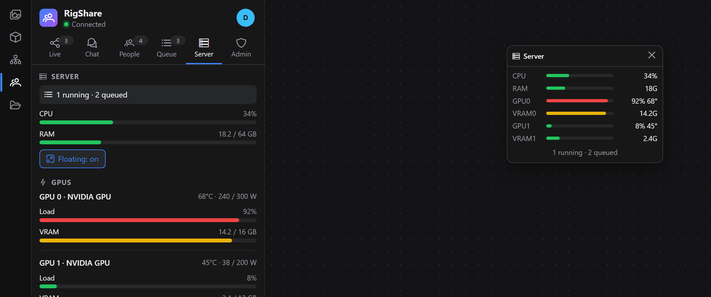<br><sub>Floating server monitor</sub>
</p>

<p align="center">
  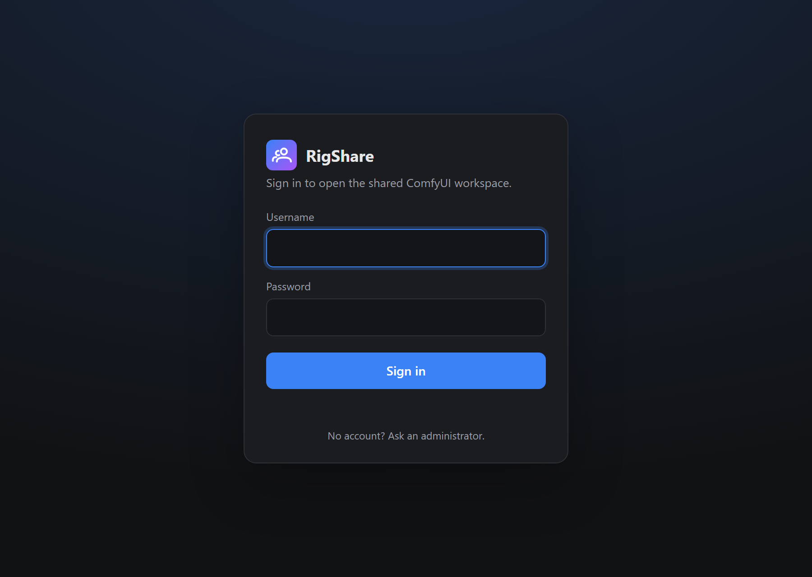<br><sub>Login page</sub>
</p>

## Getting started

Clone into `ComfyUI/custom_nodes` and restart ComfyUI:

```bash
cd ComfyUI/custom_nodes
git clone https://github.com/xiaodoudou/ComfyUI-RigShare.git
```

Open ComfyUI in a browser. There are no accounts yet, so the login page asks you to create the administrator. Sign in, open the **RigShare** tab in the sidebar and add your team under **Admin → Accounts**. That is the whole setup.

Each person gets a private **My files** folder. Put what you work on together in **Shared**, in the **Files** tab: it goes live for everyone who opens it.

Everyone then signs in at the same address. To use the API from a script, create a key under your avatar → **API keys**:

```bash
curl -H "Authorization: Bearer rs_yourkey" http://your-server:8188/api/queue
```

Behind a reverse proxy, turn on WebSocket support, or nothing will be live. See [Reverse proxy](docs/reverse-proxy.md).

## Documentation

| | |
|---|---|
| [Installing](docs/install.md) | Custom node, Docker/compose, first-run setup, upgrading from 1.0 or Nexus |
| [Files and folders](docs/files.md) | My files, Shared, All, saving, opening, who can do what |
| [Sharing workflows](docs/sharing.md) | Live workflows by folder, folder access, snapshots, follow |
| [Accounts and permissions](docs/accounts.md) | Edit, Queue, Admin, renaming, what viewers can do |
| [API access](docs/api.md) | API keys, websockets, trusted IPs, other apps such as Open WebUI |
| [Settings](docs/settings.md) | Panel settings, ComfyUI settings, every key in `config.json` |
| [Reverse proxy](docs/reverse-proxy.md) | Nginx Proxy Manager, plain nginx, HTTPS |
| [Security](docs/security.md) | How passwords, sessions and keys are protected |
| [Development](docs/development.md) | Running the tests, code layout |
| [Changelog](CHANGELOG.md) | What changed, and when |

## Why this exists

I run one ComfyUI box for several people. [ComfyUI-Nexus](https://github.com/daxcay/ComfyUI-Nexus) had the right idea, but it was written for the old UI:

- it hid menus with CSS and monkeypatched litegraph internals that no longer exist
- anyone could become admin with a shared password typed into chat
- everybody worked on one canvas, and opening ComfyUI wiped your own workflow
