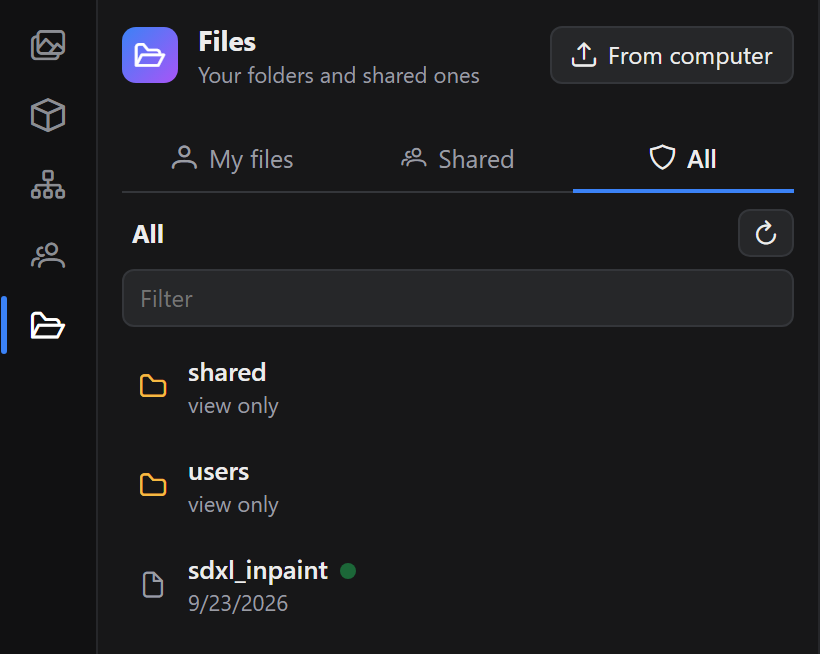

# Files and folders

RigShare organises ComfyUI's workflows folder like a shared drive. Where a workflow is saved decides who can open it and whether it is live. See [Sharing workflows](sharing.md) for the live part.

## The folders

| Folder | On disk (`user/default/workflows/`) | Who can open it |
|---|---|---|
| **My files** | `users/<you>/` | You, plus admins. Created when you first sign in. |
| **Shared folders** | `shared/<name>/` | Everyone, or only the people the folder's owner chooses. |
| **Common workflows** | anything else at the top level | Everyone, with their account permissions. |

- Workflows in My files are never live. Everything else is live while someone has it open.
- Renaming an account renames its private folder too, and open tabs follow.

## The Files tab

**Files** has its own icon in the sidebar, with three tabs:

- **My files**: your private folder.
- **Shared**: the shared folders plus the common workflows at the top level.
- **All** (admins only): the whole workflows folder, including everyone's private folders.

<table>
  <tr>
    <td align="center"> My files</td>
    <td align="center"> Shared</td>
    <td align="center"> All (admins)</td>
  </tr>
</table>

ComfyUI's own **Workflows** and **Apps** tabs are hidden, since Files replaces them, and their keyboard shortcuts open Files. Admins can bring them back under *Admin → Server settings*. Hiding them isn't what protects the files, though: the server applies the same rules whichever browser is used. If you show ComfyUI's open workflow tabs in the sidebar (*Comfy.Workflow.WorkflowTabsPosition*), the Workflows tab stays, because it lists them.

Workflows with an App set up (ComfyUI's App mode), or saved as Apps (`.app.json`), show ComfyUI's App icon. Opening an App opens it in the App view.

Click a workflow to open it. The Files tab marks live workflows with a green dot. **From computer** opens a workflow file from your machine, like ComfyUI's own *Open*.

Hover a row for its actions: **Rename**, **Move to…**, **Delete**, and on a shared folder you own, 🔒 **Who can open it**. Inside a shared folder you own, the same 🔒 sits next to the new-folder button. The folder button creates a folder. In the Shared tab it creates a shared folder that you own.

## Saving

**Save** (Ctrl+S) on a new workflow, and **Save As**, open a dialog with a name and the same three tabs. It starts in My files, or in the folder you last saved to. Pick any folder you can edit and click **Save here**. Clicking an existing workflow reuses its name, and ComfyUI asks before overwriting. Every save also keeps a snapshot in the workflow's history.

## Opening

- **Workflow → Open from RigShare…** (Ctrl+Alt+O) browses the same folders and opens a workflow.
- ComfyUI's own workflow browser still works. It lists only the workflows you can open.

## Who can do what

| | My files | Shared folder | Common |
|---|---|---|---|
| Open | owner, admins | everyone, or the folder's list | everyone |
| Save, rename | owner, admins | *Edit* permission and not *Can view* on the list | *Edit* permission |
| Delete, move out | owner, admins | the folder's owner, admins | admins |

- A shared folder's owner is whoever created it. The owner and admins can restrict it to chosen people, each with **Can view** or **Can edit**, and rename or delete it.
- The server checks every rule on ComfyUI's own file API, not just in the panel, so a script or another browser cannot get around them.
